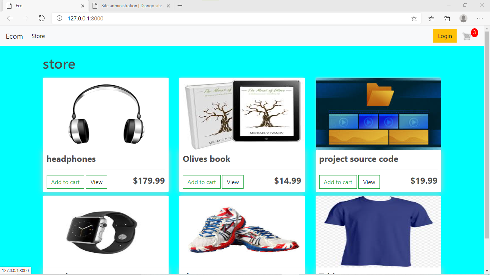
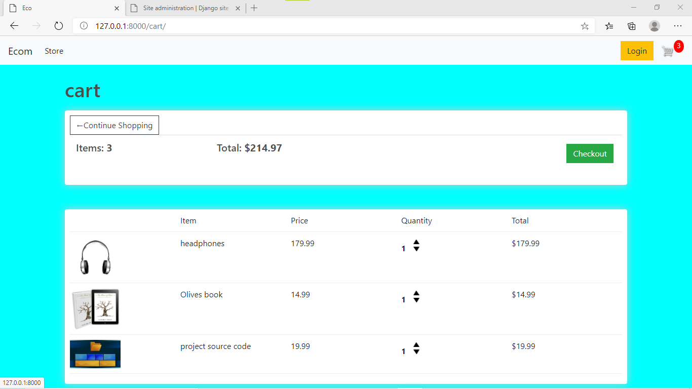
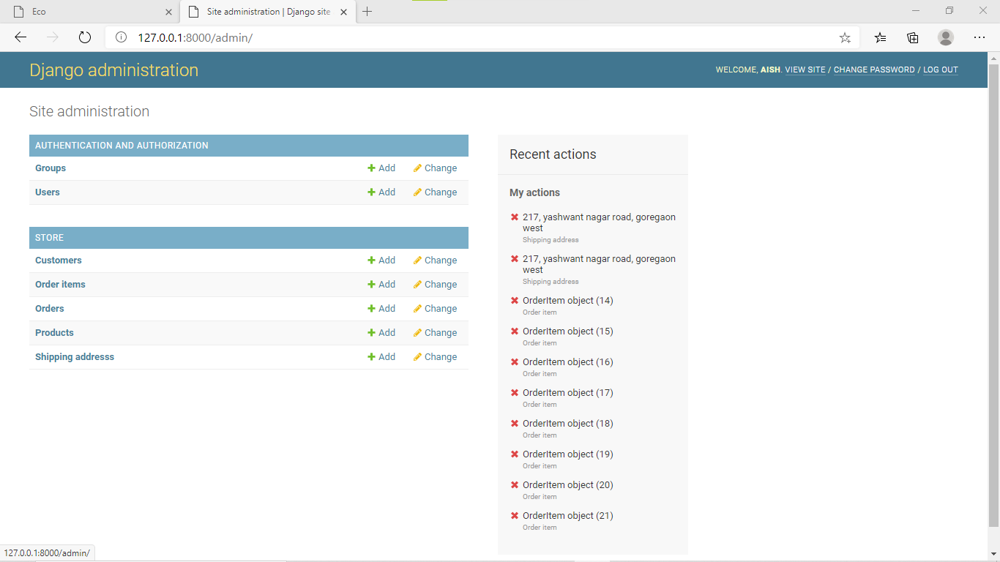
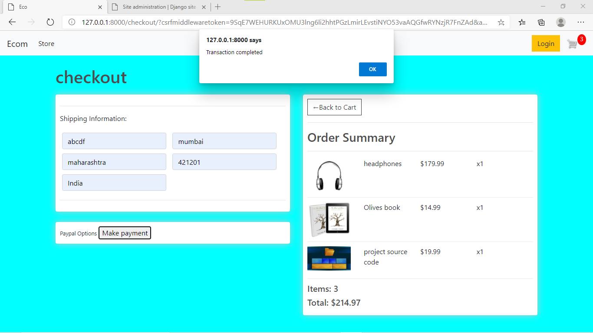
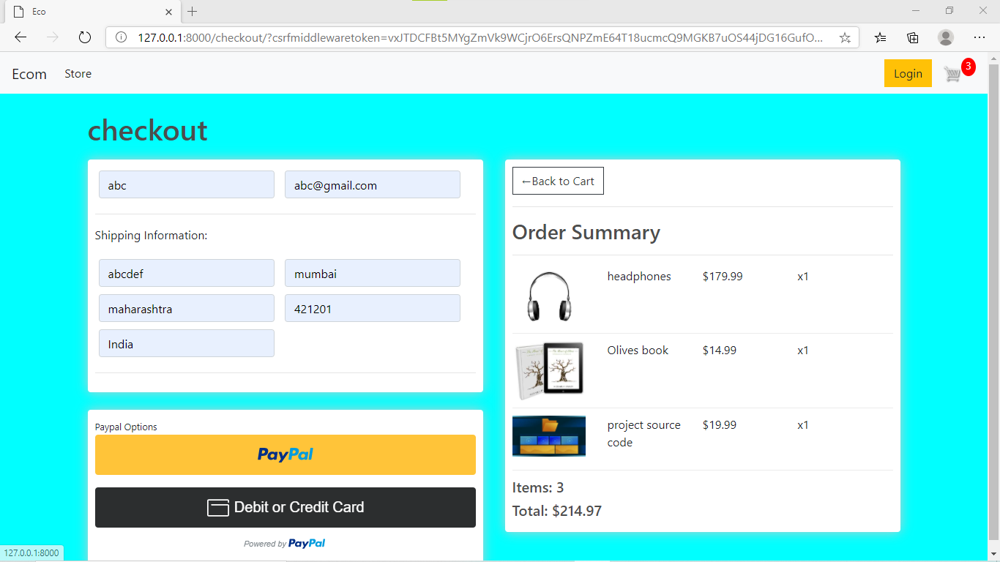

# E-com
This project is a fully functional eCommerce website with user and guest checkout capabilities. Users have the ability to add multiple products to cart, varying from physical to digital products. Payment integration handle with PayPal offering the ability to check out with a PayPal account and checkout with PayPal debit/credit card.

## Table of Contents

* [Instructions](#instructions)
* [Creator](#creators)

## Instructions

* ### Set-up Instructions
 1. Fork Repository.
 2. Install required packages for project.
 ```bash
 pip install -r requirements.txt
 ```
 3. Setup and activate environment.
 4. Run project
 ```bash
 python manage.py migrate
 python manage.py runserver
 ```

## Screen Shots.

1. There is checkout with a logged in user, we can add in the ability for users to checkout as a guest using cookies.




2. This product will be a fully functioning eCommerce website from start to checkout functionality. Users will have the ability to add multiple products to cart, varying from physical to digital products.



3.


4. Payment integration will be handled with PayPal offering the ability to checkout with a PayPal account and checkout with PayPal debit/credit card.




5. GuestUser functionality:


## creators

* Aishwarya Lingayat
    - [GitHub](https://github.com/Aishwaryalingayat)
